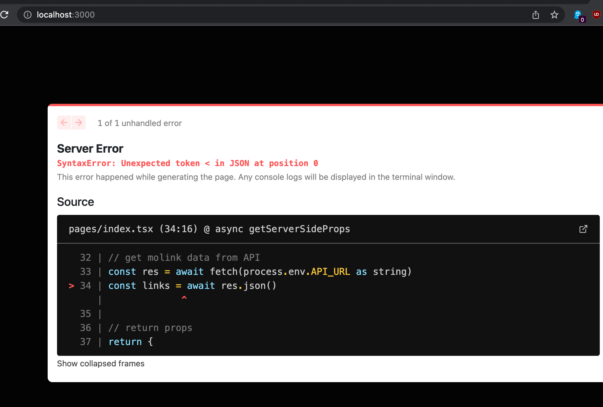

# mo links 

## what?

mo is a URL shortener and "go link" service backed by MongoDB + Atlas Services
for internal use at MongoDB. Users add their own custom or auto-shortened links
to support lower overhead navigation and sharing.
Support for quick links to some services is also built in, for example
"mgo/PYTHON-2022" links to https://jira.mongodb.org/browse/PYTHON-2022.

## why?

mo links make it easy to quickly access and share links across the company.
Go links: https://wiki.corp.mongodb.com/display/~mark.porter/Getting+More+Productive+with+Go+Links

## when?

This project was started during Buildfest 2022 a week-long hackathon like event at
MongoDB as a collaboration with the DBX + DevRel teams from September 19th-23rd.

## how?

Steps:

1. Googled "typescript fullstack app mongodb"
2. First result: https://dev.to/alexmercedcoder/building-a-full-stack-todo-list-with-mongodb-nextjs-typescript-2f75
3. Create project: `npx create-next-app --ts`
4. Project name is: mo
5. Run dev server: `npm run dev`
6. Open: http://localhost:3000
7. Install mongoose: npm install mongoose
   - Note I plan to replace mongoose with the node native driver directly but
     I want to try both.
8. 
9. TBD...